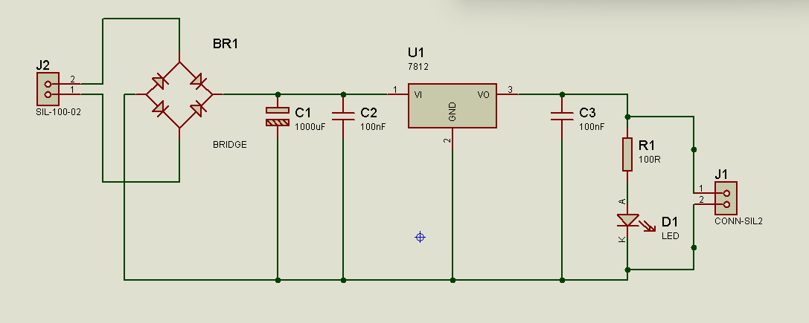
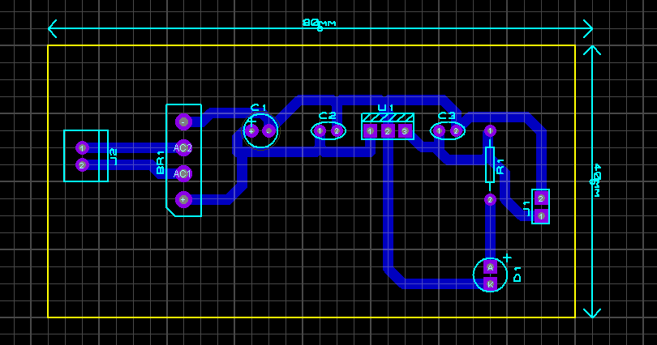
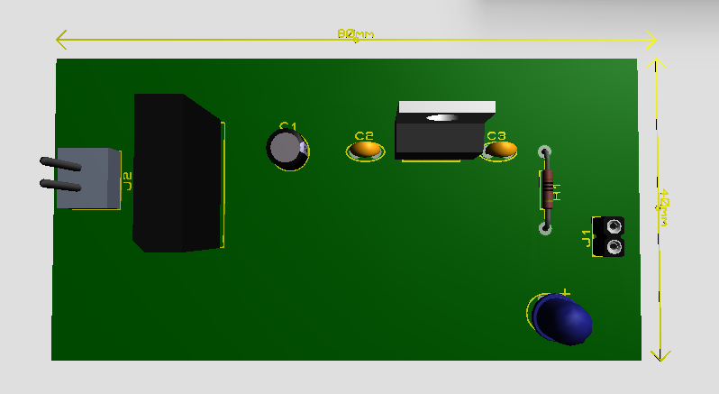
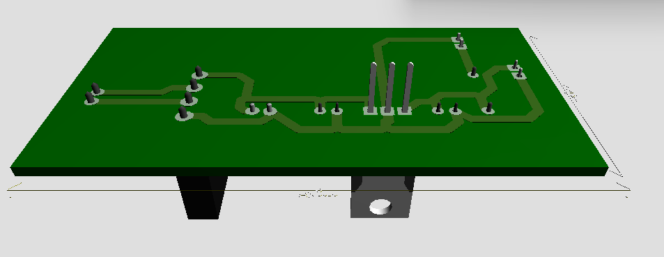

# fonte-12v-regulada-7812
# Fonte Regulada 12V com Regulador 7812

## 1. Introdução

Este projeto consiste no desenvolvimento de uma **fonte de alimentação regulada de 12V**, utilizando o regulador linear **7812**. O circuito foi projetado utilizando o software **Proteus**, incluindo:

* Esquemático do circuito
* Layout da placa PCB
* Visualização 3D da placa

A fonte recebe tensão **AC proveniente do secundário de um transformador**, realiza a **retificação da tensão**, filtra o sinal e fornece uma **saída estabilizada de 12V DC**.

---

# 2. Objetivo do Projeto

O objetivo deste projeto é demonstrar o funcionamento de uma **fonte linear regulada**, muito utilizada em circuitos eletrônicos para alimentar dispositivos que necessitam de tensão contínua estável.

O circuito realiza as seguintes etapas:

1. Entrada de tensão AC
2. Retificação da tensão
3. Filtragem do sinal
4. Regulação da tensão
5. Indicação de funcionamento através de LED

---

# 3. Esquemático do Circuito

O esquemático apresenta todos os componentes e conexões responsáveis pelo funcionamento da fonte.

---

# 4. Componentes Utilizados

| Componente | Descrição                            |
| ---------- | ------------------------------------ |
| J2         | Conector de entrada do transformador |Corrente alternada entra aqui 
| BR1        | Ponte retificadora                   |converte corrente alternada em DC pulsante
| C1         | Capacitor eletrolítico 1000µF        |filtra tensao reduzindo ripple
| C2         | Capacitor cerâmico 100nF             |remove ruidos alta frequencia
| U1         | Regulador de tensão 7812             |tensao entra aqui e fica estabilizada em 12V
| C3         | Capacitor cerâmico 100nF             |esse capacitor melhora a estabilidade de saida que veio do regulador de 12V
| R1         | Resistor 100Ω                        |O resistor limita a corrente para o LED não queimar.
| D1         | LED indicador                        |LED indica funcionamento e a tensão regulada sai pelo conector J1.
| J1         | Conector de saída                    |Saida 12V DC e GND

 # 4. Componentes Utilizados

| Componente | Descrição | Função no Circuito |
|------------|-----------|--------------------|
| J2 | Conector de entrada do transformador | Corrente alternada (AC) entra no circuito por aqui |
| BR1 | Ponte retificadora | Converte corrente alternada (AC) em DC pulsante |
| C1 | Capacitor eletrolítico 1000µF | Filtra a tensão e reduz o ripple |
| C2 | Capacitor cerâmico 100nF | Remove ruídos de alta frequência |
| U1 | Regulador de tensão 7812 | Estabiliza a tensão de saída em 12V |
| C3 | Capacitor cerâmico 100nF | Melhora a estabilidade da saída do regulador |
| R1 | Resistor 100Ω | Limita a corrente para proteger o LED |
| D1 | LED indicador | Indica que o circuito está energizado |
| J1 | Conector de saída | Fornece a saída 12V DC e GND |
---

# 5. Funcionamento do Circuito

## 5.1 Entrada de Tensão

A entrada do circuito ocorre através do conector **J2**, onde é conectada a saída do **secundário de um transformador**.

O transformador reduz a tensão da rede elétrica para um valor seguro (por exemplo 12V AC).

---

## 5.2 Retificação da Tensão

A tensão AC proveniente do transformador é aplicada à **ponte retificadora BR1**.

A ponte retificadora é composta por quatro diodos e tem a função de converter a tensão **AC (corrente alternada)** em **DC pulsante (corrente contínua)**.

Após essa etapa, a tensão já possui polaridade positiva e negativa definidas.

---

## 5.3 Filtragem da Tensão

Após a retificação, a tensão ainda apresenta **ondulações (ripple)**.

Para reduzir essas variações é utilizado o capacitor:

**C1 – 1000µF**

Esse capacitor funciona como um **filtro**, armazenando energia e suavizando a tensão, tornando-a mais próxima de uma tensão contínua.

O capacitor **C2 (100nF)** também atua como **desacoplamento**, reduzindo ruídos de alta frequência.

---

## 5.4 Regulação de Tensão

A tensão filtrada é aplicada ao **regulador de tensão 7812 (U1)**.

O regulador 7812 possui três pinos:

| Pino | Função            |
| ---- | ----------------- |
| 1    | Entrada de tensão |
| 2    | Terra (GND)       |
| 3    | Saída regulada    |

Este componente mantém a saída **estável em 12V**, mesmo que ocorram pequenas variações na tensão de entrada.

O capacitor **C3 (100nF)** melhora a estabilidade da saída do regulador.

---

## 5.5 LED Indicador

O LED **D1** funciona como um **indicador visual de funcionamento**.

Quando a fonte está energizada, a corrente passa pelo resistor **R1 (100Ω)** e pelo LED, fazendo com que ele acenda.

O resistor limita a corrente para evitar que o LED seja danificado.

---

## 5.6 Saída da Fonte

A saída da fonte ocorre através do conector **J1**, onde temos:

* Pino 1 → +12V regulado
* Pino 2 → GND

Essa saída pode ser utilizada para alimentar diversos circuitos eletrônicos.

---

# 6. Layout da PCB

A placa foi projetada com dimensões:

**80mm x 40mm (8cm x 4cm)**

O layout foi organizado para facilitar a montagem e reduzir o comprimento das trilhas.

---

# 7. Visualização 3D da Placa

Vista superior:

Vista inferior:

A visualização 3D permite observar a disposição real dos componentes na placa.

---

# 8. Etapas de Funcionamento da Fonte

O funcionamento completo ocorre na seguinte sequência:

1️⃣ Transformador reduz tensão da rede elétrica
2️⃣ Ponte retificadora converte AC em DC
3️⃣ Capacitor filtra a tensão
4️⃣ Regulador 7812 estabiliza em 12V
5️⃣ LED indica funcionamento
6️⃣ Tensão regulada é disponibilizada na saída

---

# 9. Aplicações

Fontes reguladas como esta podem ser utilizadas em:

* Projetos com Arduino
* Circuitos eletrônicos
* Protótipos de robótica
* Sistemas embarcados
* Alimentação de sensores

---

# 10. Software Utilizado

O projeto foi desenvolvido utilizando:

**Proteus Design Suite**

Ferramentas utilizadas:

* ISIS → Esquemático
* ARES → Layout PCB
* 3D Viewer → Visualização da placa

---

# 11. Função de Cada Componente

J2 (Entrada)
Conector onde é ligado o secundário do transformador, fornecendo tensão AC ao circuito.

BR1 (Ponte retificadora)
Converte a tensão AC em DC pulsante utilizando quatro diodos.

C1 (1000µF)
Capacitor de filtragem que reduz o ripple da tensão após a retificação.

C2 (100nF)
Capacitor de desacoplamento que ajuda a eliminar ruídos de alta frequência na entrada do regulador.

U1 – 7812
Regulador linear responsável por manter a saída estabilizada em 12V DC.

C3 (100nF)
Capacitor de estabilização da saída do regulador, evitando oscilações e ruídos.

R1 (100Ω)
Resistor limitador de corrente para proteger o LED.

D1 (LED)
Indicador visual de que a fonte está energizada.

J1 (Saída)
Conector onde é disponibilizada a tensão regulada de 12V DC.

13. Observação Técnica

O regulador 7812 necessita que a tensão de entrada seja maior que a tensão de saída. Normalmente são necessários aproximadamente 14V a 15V na entrada para garantir uma saída estável de 12V.

---

# 12. Autor

Projeto desenvolvido para atividade acadêmica de Sistemas Embarcados.

Autor: Rafael Fontana
